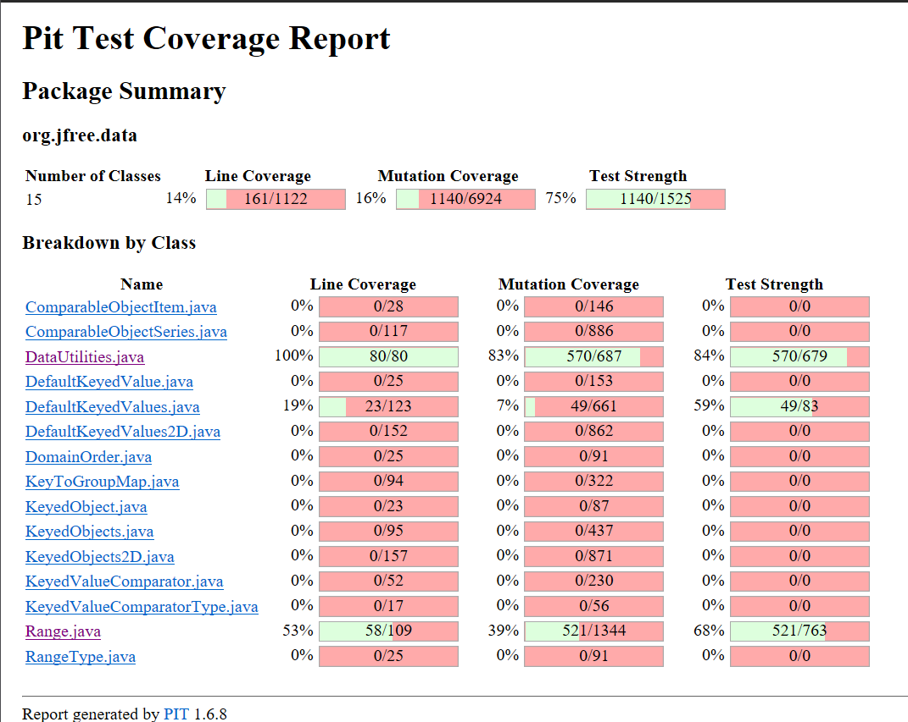
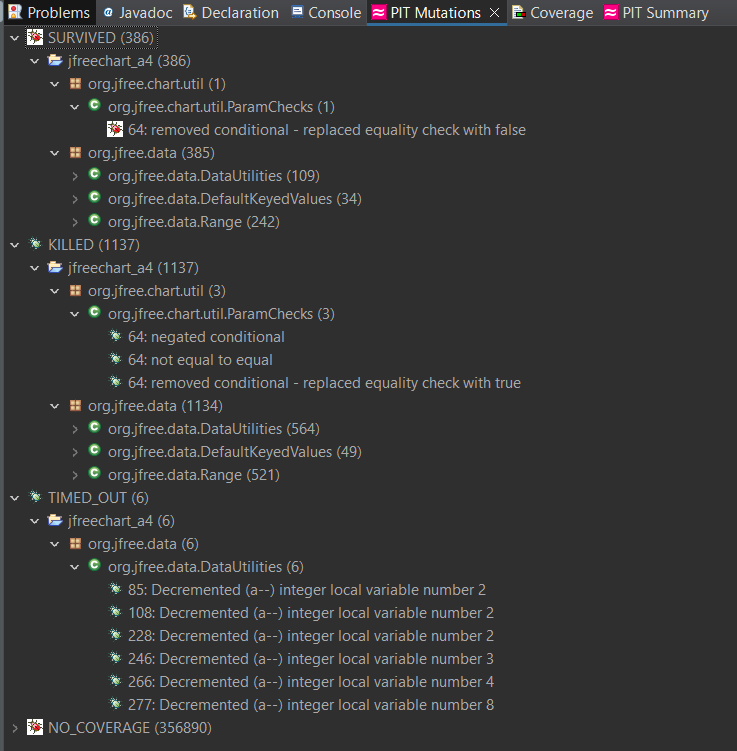
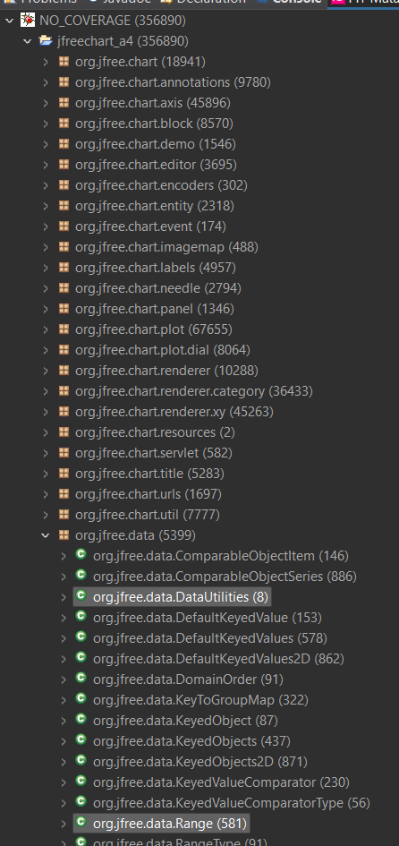
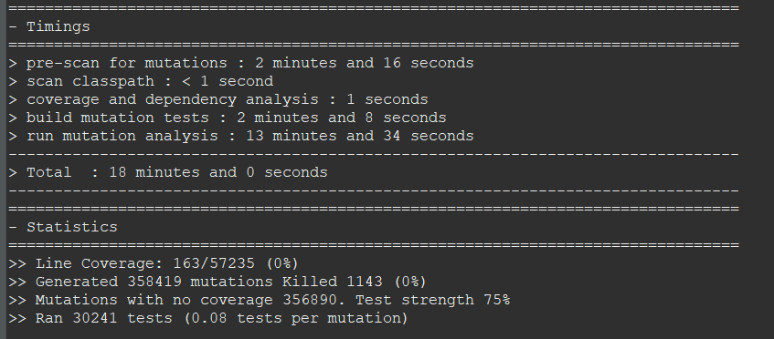
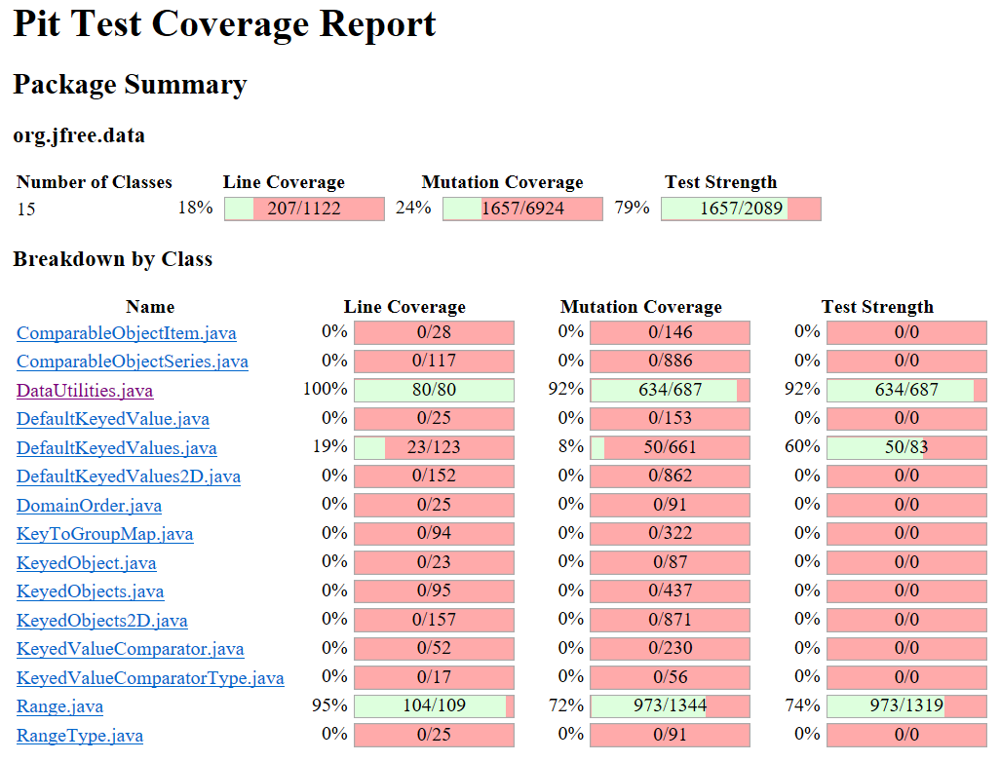
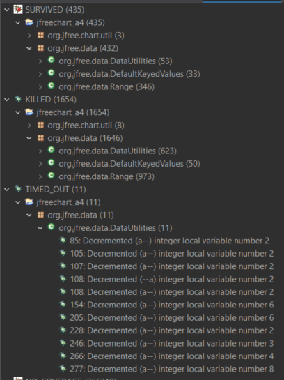
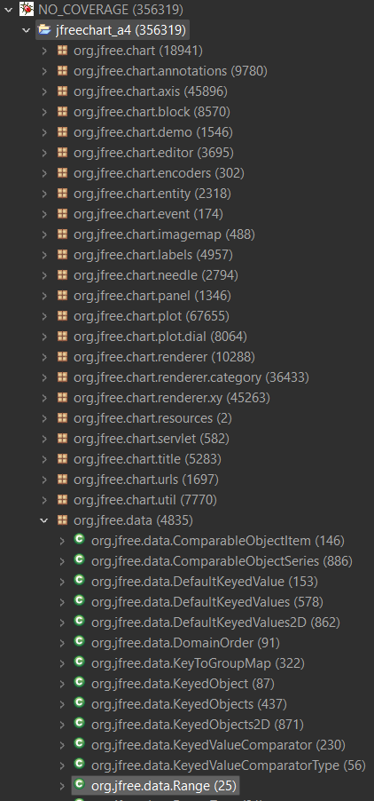

**SENG 438 - Software Testing, Reliability, and Quality**

**Lab. Report \#4 – Mutation Testing and Web app testing**

| Group \#:      |  1   |
| -------------- | --- |
| Student Names: |     |
|        Xian Wei Low        |  30113016   |
|       Akashdeep Singh         |  30128444   |
|        Abdul Moeiz        |  30113088   |
|Cale Morash              |30066719|

# Introduction
In this lab, we will be breaking down two separate objectives. In the first section, we will be focusing on mutation testing which will use Pitest in the eclipse marketplace to test out our mutation coverage based on the code we have written in the previous lab. We will learn how to interpret and increase our mutation coverage which in turn will make our tests even more accurate. In the second part of this lab, we will be using Selenium to test a GUI that has been implemented by well known companies. To fully test it, it will need to check various conditions based on what is being tested. If a section of the GUI is non-functional, we will mark down what went wrong and the steps needed to reproduce the error. Since Selenium automates these tests, the steps to reproduce an error will be clearly laid out to the developers.

# Analysis of 10 Mutants of the Range class
You may view the detailed log at [./mutation_test_results/before/](./mutation_test_results/before/) and extracting the zip folder (instrucitons provided).
### 1. `contains(double value)`
```
16. Negated double field lower → SURVIVED
```
Instead of `return (value >= this.lower && value <= this.upper);` the mutation returns `return (value >= -this.lower && value <= this.upper);`. However, the mutation survives the test and it is clear that this mutation is not an equivalent one rather a mutant that should have been killed.

The methods with prefix `testContains<...>` test the contains() method. The issue is the fact that the Range is initialized to a value of zero for the lower bound. Thus, the negation of the lower bound is still zero.
### 2. `contains(double value)`
```
18. Negated double field upper → KILLED
```
Mutations for field upper indeed are killed as the value of upper initialized in the test cases are non-zero in the same test cases mentioned before.
## 3. `constrain(double value)`
```
2. Incremented (a++) double local variable number 1 → SURVIVED
```
The mutation is `double result = value++;`. The test cases with prefix `testConstrain<...>` test the constrain() method. The issue is the fact that the variable **value** is post incremented but the return in result is the original value, so the assertion does not fail.
However, still this mutant should be killed as it is not equivalent. The edge case that we did not test is when **value** is inside the range but **value+1** is not, so beyond the upper limit. `testConstrainWhenInputEqualToUpper` can be enhanced to handle this situation and kill this mutant.
### 4. `constrain(double value)`
```
4. Incremented (++a) double local variable number 1 → KILLED
```
The mutation is `The mutation is `double result = ++value;`. The same issue as above occurs, however the return value is value incremented, and the assertions in the test cases are able to kill this mutant.
### 5. `combine(Range range1, Range range2)`
```
7. Incremented (a++) double local variable number 4 → SURVIVED
```
The mutation is `return new Range(l, u++);`. Although, it is true that the code is different the code can still be considered an equivalent mutant as post-increment allows u++ to return the non-incremented value, which means the behaviour of the code is the same as the original one.
The test cases with prefix `testCombine<...>` test this method.
### 6. `combine(Range range1, Range range2)`
```
11. Incremented (++a) double local variable number 4 → KILLED
```
The mutation is `return new Range(l, ++u);`
This time the return value is pre-increment so it will return u+1 instead of u. Therefore, the test cases are able to catch the assertion error when the upper bound is verified.
### 7. `expandToInclude(Range range, double value)`
```
1. negated conditional → KILLED
```
The mutation is `if !(range == null) {`. The mutation was killed as the next conditional statements range.getLowerBound() does not allow range to be null. Therefore, this is a mutant that get's killed regardless of correctness of test cases.
### 8. `expandToInclude(Range range, double value)`
```
1. replaced return value with null for org/jfree/data/Range::expandToInclude → KILLED
```
The mutation is `return null` instead of `return range`. Returning null causes assertion failures on the test cases with prefix `testExpandToInclude<...>` as none of them expects the return value to be ever null. A range is always returned by the program. So the mutant is killed.
### 9. `equals(Object obj)`
```
2. removed conditional - replaced equality check with false → SURVIVED
```
The mutation replaces `if (!(this.lower == range.lower))` to `if (false)`. This cases to move the equality check to move the next line, the next conditional statement.
The test cases with prefix `testEquals<...>` do not have a test case for the following type of input
```
		range1 = new Range(0, 0);
		range2 = new Range(1, 0);
```
where the upper bound is same but the lower bound is different. For such a test case, the mutation would return true but the expected answer is false. So, the mutant survives due to missing a test case with such a type of input.

### 10. `equals(Object obj)`
```
3. removed conditional - replaced equality check with true → KILLED
```
The mutation replaces `if (!(this.lower == range.lower))` to `if (true)`. This causes to always return false, which is the code that runs if the condition is evaluated true. However, since our test cases have inputs with same values the expected answer is true but since always false, the mutant is killed.


# Report all the statistics and the mutation score for each test class
## Original mutation statistics






## Mutation statistics after improvements




## New test cases for Range.java
- testConstructorRangeValues()
- testIntersectWhenInputContainsRange()
- testCombineIgnoringNaN_null()
- testCombineIgnoringNaN_whenIntersect()
- testCombineIgnoringNaN_whenNoIntersect()
- testExpandWhenRangeParamNull()
- testExpandLowerLessThanUpper()
- testExpandWhenInputLengthIsZero()
- testExpandNewRangeLowerEqualToUpper1()
- testExpandNewRangeLowerEqualToUpper2()
- testExpandNewRangeLowerGreaterThanUpper()
- scaleNullParam()
- scaleLarge()
- scaleSmall()
- testShiftNullParam()
- testShiftNullParamWithNoZeroCrossing()
- testShiftLeftWithZeroCrossing1()
- testShiftLeftWithZeroCrossing2()
- testShiftLeftWithZeroCrossing3()
- testShiftLeftWithZeroCrossingAtZero()
- testShiftRightWithZeroCrossing1()
- testShiftRightWithZeroCrossing2()
- testShiftRightWithZeroCrossing3()
- testShiftRightWithZeroCrossingAtZero()
- testShiftLeftWithNoZeroCrossing1()
- testShiftLeftWithNoZeroCrossing2()
- testShiftLeftWithNoZeroCrossing3()
- testShiftLeftWithNoZeroCrossingAtZero()
- testShiftRightWithNoZeroCrossing1()
- testShiftRightWithNoZeroCrossing2()
- testShiftRightWithNoZeroCrossing3()
- testShiftRightWithNoZeroCrossingAtZero()

## New test cases for DataUtilities.java
### calculate column and row total
- calculateColumnTotalForRowTwoValueCheckRow()
- calculateRowForOneColumnValueRowEqualRowCount()
- calculateRowForOneColumnValueWithNullValues()
- calculateRowForOneColumnValuesNullVal
- calculateRowForOneColumnValueWithNullValues
- calculateRowForTwoValuesWithNullValues()
- calculateRowForTwoValuesWithZeroColumns()
### array
- testArrWithNullRows()
- create2DNumberArrayNullVal
### clone test
- testNullVal
### equal test
- testNullity()
- testLength()
- testEqual()
### cumulative percentages
- getCumulativePercentagesNullParam()
- getCumulativePercentageWithNullVal()

# Analysis drawn on the effectiveness of each of the test classes
## `Range.java`
The original method coverage was 39% and after the imporovements the method coverage significantly improved to 72%. The reason for that is that main reason why the coverage was intially low is due to not having covered other methods in class.
Also we are able to kill mutants that would modify the lower and upper bounds between functions and still return same result. This has been mostly effective by asserring that the bounds do not modify after any function call.

Thus, not only more methods were covered but there were fewer survived mutants in the test case.
## `DataUtilities.java`
The original method coverage was 83% and after the improvment the method coverage it is 92%. In the original test code the methods were all covered fairly well and therefore the original coverage was alreadhy high. However, we noticed some mutants that survived when for instance we do not include null elements in the array when doing some function calls. Some mutation involved modifying conditional branches that check if elements are null or not to always true. However, by including newer test cases we made the testing more robust and were able to kill such mutants.

Although, we noticed that improvement was very hard to bump up as the original score was already high and reaching mutation coverage above 90% becomes harder, as discussed in lectures, as equivalent mutants can come in to play.

Equivalents mutants might have interfed with out true accuracy which might be higher than 92%.

# A discussion on the effect of equivalent mutants on mutation score accuracy
Equivalent mutants occur when the code mutated has the same logic and output despite the code text being different. One of the manual ways we spotted equivalent mutations is by looking at a detailed summary of the Range.java and DataUtilities.java code.
We noticed some common equivalent mutations. One was where the pretest condition of for loop being in the format of `a = 0; a < b; a++` to the format of `a = 0; a !=b; a++`. Even if the code is different, the behaviour of both is the same as the loop runs exactly for the same amount of times.

Another possible equivalent mutation we believe to be found is the `calculateColumnTotal` and `calculateRowTotal   ` methods of the **DataUtilies** class. The code sums up the the total of element in an array (initial value of sum is 0) and later returns the total. However, one thing we noticed in the mutations log is that the **total** variable was being substracted by the i-th element of the array and later returning the negation of it.
So, something like as follows
```
total = 0; for every element in arr {total += element}; return total;
total = 0; for every element in arr {total -= element}; return -total;
```
As it can be seen the behaviour of both lines is the same!
So, this implies that even if our test cases method appropriately test the input and outputs, such mutants cannot be kiled since the test cases expect the code to behave that logical manner, regardless of the different possible ways of doing it. This is also why equivalent mutants will survive and later impact the accuracy of method coverage being lower than the actual true method coverage.

# A discussion of what could have been done to improve the mutation score of the test suites
For the `Range` class adding test cases for uncovered methods would have improved the mutation score. This effect was significant. However, to minimize survived mutants the test cases for same method needed to handle more edge cases so that mroe mutants get killed. We believe there is a larget room and potential to improve mutation score as edge cases test can still be added to exactly kill more  mutants.
`DataUtilites` class already had a higher mutation score and enhancing test cases to kill more mutants allowed to achieve amutation score already above 90%. Despite many attempts increasing mutation score was very tough. 

# Why do we need mutation testing? Advantages and disadvantages of mutation testing
Mutation testing is needed to verify the quality of test cases designed. Just verifying a test case passing is not always sufficient as any software engineer might modify the source code at any later point of time. Such a modification can be thought as some form of mutation. What we need to ensure is that through these mutation the test cases still detect errors. As we have seen mutation testing may be a suitable measure and assessement to judge the quality and robustness of these test cases.

However, mutation coverage is not always a good measure to assess test robustness and sometimes it may be excessive. Also, equivalent mutants may sometimes mislead (hence that's where the measure may be inaccurate) the judging and quality of the test cases the moment a user tries to achieve high mutation coverage. Also, it could be excessive as not all mutations are likely to happen. And this might be a costly appraoch, so an appropriate balance between target mutation coverage to achieve and effort taken in the test cases may be needed.

Also, making test cases more robust may also lead to making test cases more complicated and longer. This is what we noticed when we try to add more lines of code in test cases to just kill more mutants.

In, summary mutation testing is an effective approach to verify that test cases, where for instance test cases sometimes may not validate edge cases, are robust and detect bugs the moment slight or more changes to source code are bringed. However, there should be a balance between the effort spent and quality of test cases as achieving higher mutation coverage may start making test cases more complex with small or unsignficant gains.

# Explain your SELENUIM test case design process
Selenium test cases were created within the Selenium IDE. We created the frame of the test case by using the IDE's web function recording tool. Once the peripheral inputs were captured, we would refine the test case by removing all of the unnecessary functions, such as the scroll and mouse movement functions. Finally, we test the test case to ensure it tests the intended functionality properly, adjusting the target and value parameters as necessary. 
# Explain the use of assertions and checkpoints
Assertions and checkpoints were used generally for the same purpose, but in different ways. They both allowed us to check the state of the values and targets between the IDE and the website. Breakpoints proved to be beneficial when inspecting multiple parameters within the website as it gives the user a break to check whether the script is on the right track or not. Assertions allow the user to verify a specific parameter quickly without disrupting the flow of the test script. 
# how did you test each functionaity with different test data
In the creation of our test cases, we tested the functional requirements that allowed various inputs with different test data across the test cases. More specifically, with the add to cart functionality, we created tests that added a single item, multiples of the same item, and multiple different items. Also with the language tests, we made sure to check that Amazon will be able to go from english to french and french to english. 
# Discuss advantages and disadvantages of Selenium vs. Sikulix
The main advantage of Selenium when compared to a tool like Sikulix is that is can be downloaded right on your web browser or as an individual ide. This allows the user to record the exact steps by tracking everything being done on the GUI. This includes clicking on buttons, hovering over drop-down menus, etc. Another big advantage for Selenium is that it is simple to use. Each button is intuitive and tells you exactly what it does. It will take an average user very little time to learn how to use the program. A disadvantage of the Selenium ide is that it can be very slow and sometimes crashes the web browser. Siklulix allows image recognition which can in certain situations be better when compared to Selenium since Selenium will take the HTML source code to automate the testing done. 
# How the team work/effort was divided and managed
For this lab, we have separated the work by letting two people work on the range mutation testing and the other two to work on the data utilities mutation testing. As for the GUI testing, we assigned each other to make 2 GUI automated tests on Selenium. 

# Difficulties encountered, challenges overcome, and lessons learned
Within this lab, we have encountered some problems/difficulties with both parts. In the first section, since we had a high mutation coverage for data utilities, it was harder to increase the percentage and discovered that it will require tests that will be harder to implement. For the GUI testing, we were testing out the Amazon website which proves some problems. For example when testing adding items, the item is not always at the same position and also not always available which proves problems for the automation. If it can be replaced, the automation will automatically choose an item which is good but in the end will prove problems when it reaches the assert. What we have learned from this is that some manual testing or a user being there watching over the tests are sometimes required when testing an always updating GUI element. 
# Comments/feedback on the lab itself
As a whole, this lab was insightful and gave us the knowledge to further improve our test cases. For the GUI testing, we learned that Selenium can be used for automation whether it be for automated testing or just purchasing a bunch of one product. This knowledge can allow us to use this program for purposes even outside our degrees.
